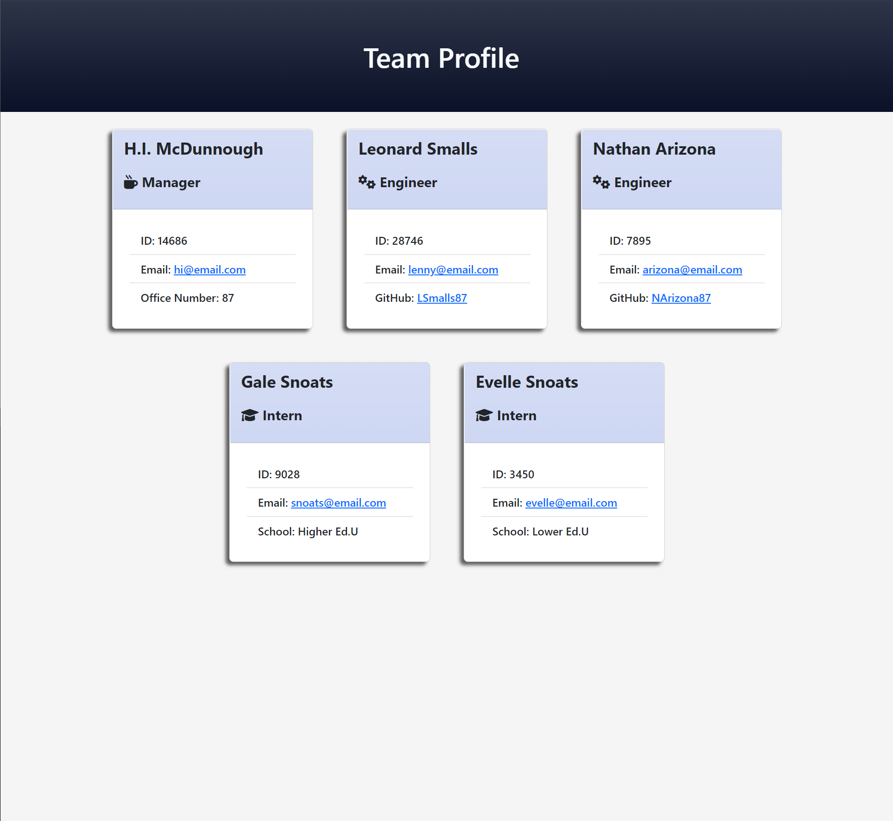

# teamProfileGenerator  

## Description: 

* A Node.js CLI application that takes in information about employees on a software engineering team and generates an HTML webpage that displays summaries for each person

* <a href='https://www.github.com/BDunham484/teamProfileGenerator'>https://www.github.com/BDunham484/teamProfileGenerator</a>

## Table of Contents

- [Installation](#installation)
- [Usage](#usage)
- [License](#license)
- [Code Contributors](#code-contributors)
- [Contributing](#contributing)
- [Test](#test)
- [Questions](#questions)

## Installation

* Clone the repository
*  Open in your desired text editor
*  Run `npm init` from the command line
*  Run `npm install inquirer` from the command line

Back to [top of page](# )

## Usage

* Run `node index` from the command line to initiate a series of questions about your team. Your ersponses are then used to populate a series of Bootstrap cards that are dsplayed on a dynamically generated `HTML` page. Upon completion, the file will be saved in the `dist` folder along with a copy of the `CSS` style sheet.

Back to [top of page](# )

## License

* This application is covered under the <a href='https://opensource.org/licenses/MIT'>MIT License</a>.

Back to [top of page](# )

## Code Contributors

#### Made with ❤️ by:

* Brad Dunham

Back to [top of page](# )

## Contributing

Feel free to submit an issue!

Back to [top of page](# )

## Test

* Tests can be run by entering `npm run test` in the command line.

Back to [top of page](# )

## Questions?

* If you have any questions you can find me here: <https://www.github.com/BDunham484>
* You can also reach me here: bdunham484@gmail.com

Back to [top of page](# )

    